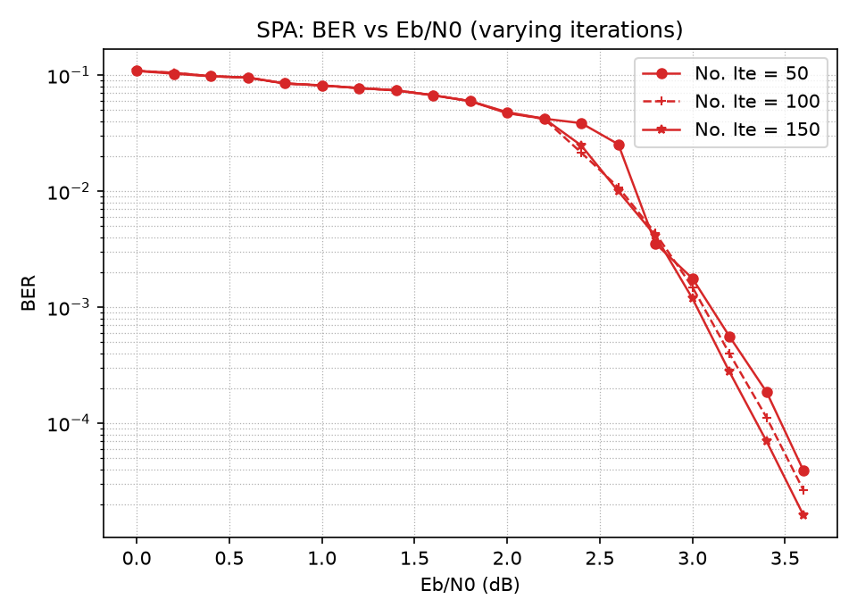
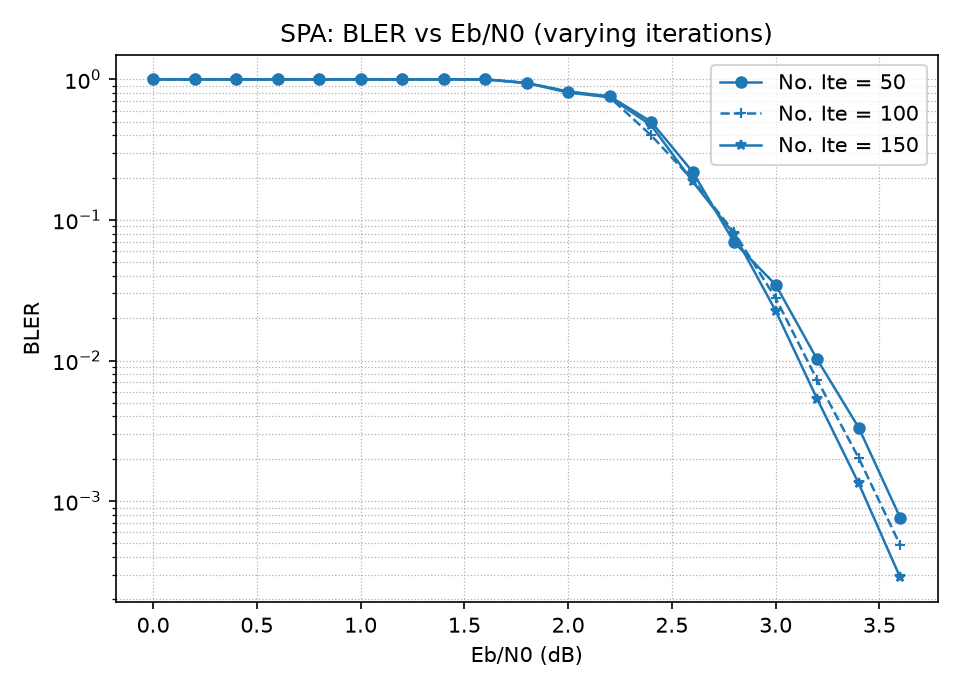
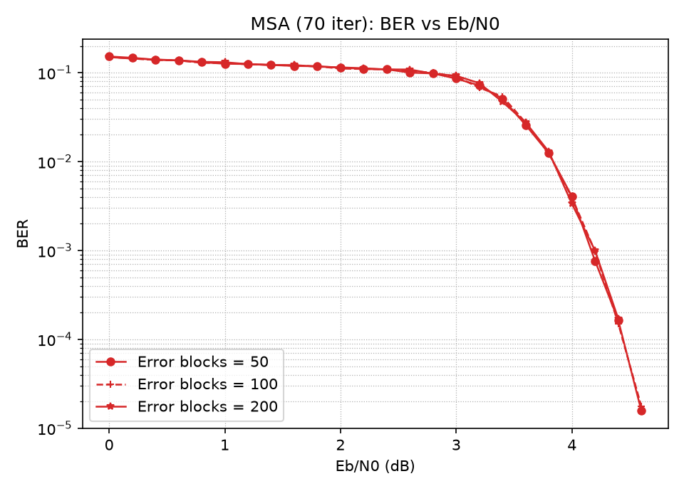
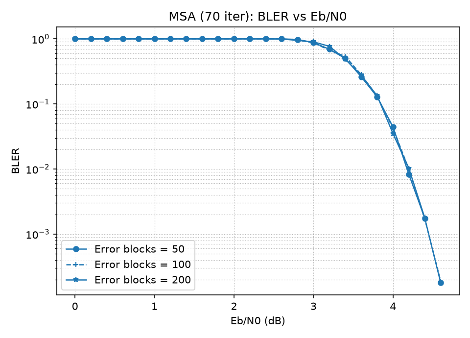

# LDPC (1023, 781) Decoder & AWGN Simulator


[](LICENSE)
-orange.svg)

> Hand-written sum-product / min-sum LDPC decoder in C, with an AWGN
> Monte-Carlo simulator that reproduces the code's BER/BLER waterfall.

A from-scratch C implementation of an iterative **Low-Density Parity-Check (LDPC)**
decoder, with a Monte-Carlo simulator that measures bit-error rate (BER) and
block-error rate (BLER) over an AWGN channel. Built for a graduate
Error-Correcting-Codes course; the decoder, channel model, and pseudo-random
number generator are all implemented by hand (no external coding libraries).

The code under test is the length **n = 2¹⁰ − 1 = 1023**, dimension **k = 781**
regular LDPC code (a type-I two-dimensional Euclidean-geometry / finite-geometry
code in the sense of Kou–Lin–Fossorier). Its parity-check matrix `H` is
**(32, 32)-regular** — every row and every column has weight 32 — and is stored
in sparse adjacency form rather than as a dense 1023×1023 matrix.

## Highlights

- **Two decoding rules** sharing one message-passing engine:
  - **SPA** — Sum-Product Algorithm (exact belief propagation), implemented with
    the numerically stable *box-plus* operator
    `a ⊞ b = sign(a)sign(b)·min(|a|,|b|) + log(1+e^−|a+b|) − log(1+e^−|a−b|)`.
  - **MSA** — Min-Sum Algorithm, the `sign × min-magnitude` approximation.
- **O(d) check-node update** via a forward/backward sweep, so producing all
  "exclude-one" extrinsic messages for a degree-*d* node is linear, not
  quadratic.
- **Early termination** by syndrome check — decoding stops the instant the hard
  decision is a valid codeword.
- **Reproducible channel** — BPSK + AWGN using the `ran1` generator
  (Numerical Recipes) with a Bays–Durham shuffle, so a fixed seed gives
  identical results on any platform.
- **Sparse Tanner graph** with precomputed edge-slot maps for O(1) message
  exchange between variable and check nodes.
- Portable ISO C11, no dependencies beyond `libm`; compiles clean under
  `-Wall -Wextra`.

## Repository layout

```
.
├── src/
│   ├── ldpc.{h,c}      # code construction: H/G loading, Tanner graph, config
│   ├── encoder.{h,c}   # PRBS information source + systematic encoder
│   ├── channel.{h,c}   # ran1 PRNG, BPSK modulation, AWGN, channel LLRs
│   ├── decoder.{h,c}   # SPA / MSA belief propagation + syndrome check
│   └── main.c          # Monte-Carlo BER/BLER simulation loop
├── config/sim.txt      # simulation parameters (key = value)
├── data/
│   ├── ldpc_H_1023.txt # parity-check matrix (sparse adjacency lists)
│   └── ldpc_G_1023.txt # systematic generator matrix
├── python/             # matplotlib plotting (plot_results.py + requirements.txt)
├── matlab/             # original MATLAB plotting scripts (same data)
├── figures/            # rendered BER/BLER curves (embedded below)
├── docs/               # project report (PDF)
└── Makefile
```

## Build & run

```sh
make            # builds ./ldpc_sim
make run        # builds, then runs with config/sim.txt
./ldpc_sim config/sim.txt
```

Results are printed to the console and written to
`results/results_<ALGO>.csv` (columns: `snr_db, blocks, error_blocks,
error_bits, ber, bler`).

## Configuration

`config/sim.txt` is a simple `key = value` file (`#` starts a comment):

| key             | meaning                                            |
| --------------- | -------------------------------------------------- |
| `code_n` / `code_m` | codeword / information length (1023 / 781)     |
| `row_weight` / `col_weight` | 1's per row / column of `H` (32 / 32)  |
| `h_file` / `g_file` | paths to the matrix files                      |
| `algorithm`     | `SPA` or `MSA`                                     |
| `max_iter`      | maximum BP iterations per block                    |
| `snr_start` / `snr_step` / `snr_points` | Eb/N0 sweep in dB          |
| `target_errors` | block errors to accumulate per SNR point           |
| `seed`          | `ran1` seed (negative integer)                     |
| `output_dir`    | where the CSV is written                           |

## Example output

A short SPA sweep (`max_iter = 50`, 30 error blocks per point) shows the
characteristic LDPC *waterfall*:

| Eb/N0 (dB) |   BER    |   BLER   |
| ---------- | -------- | -------- |
| 1.0        | 8.4×10⁻² | 1.00     |
| 2.0        | 5.0×10⁻² | 0.86     |
| 3.0        | 1.3×10⁻³ | 2.5×10⁻² |
| 4.0        | < 10⁻⁵   | < 10⁻³   |

### Measured performance curves

The full sweeps from the project are below. **SPA** is shown at several
iteration caps (more iterations → a sharper waterfall); **MSA** at a fixed 70
iterations is shown for three Monte-Carlo error-block targets, confirming the
estimate is stable regardless of how many error blocks are collected.

| | BER | BLER |
| --- | --- | --- |
| **SPA** (varying iterations) |  |  |
| **MSA** (70 iterations) |  |  |

Regenerate the figures with either toolchain (both use the same data):

```sh
pip install -r python/requirements.txt
python python/plot_results.py        # writes figures/*.png
```

The original MATLAB scripts in `matlab/` produce the same plots, and the
experiment is discussed in the project report under `docs/`.

## How it works

1. **Source & encode.** A maximal-length LFSR (PRBS) produces information bits,
   which are encoded by the systematic generator matrix `G` over GF(2).
2. **Channel.** Bits are BPSK-modulated (0 → +1, 1 → −1), corrupted with
   additive white Gaussian noise at the configured Eb/N0, and converted to
   log-likelihood ratios `L = (4·R·Eb/N0)·y`.
3. **Decode.** Belief propagation alternates check-node and variable-node
   updates on the Tanner graph; after each iteration the hard decision is tested
   against every parity check and decoding stops early on success.
4. **Measure.** Information-bit and block errors are accumulated until
   `target_errors` block errors are seen, then BER and BLER are reported.

## Author

TimmyPan — graduate Error-Correcting-Codes course project.

## License

Released under the MIT License. See [LICENSE](LICENSE).
